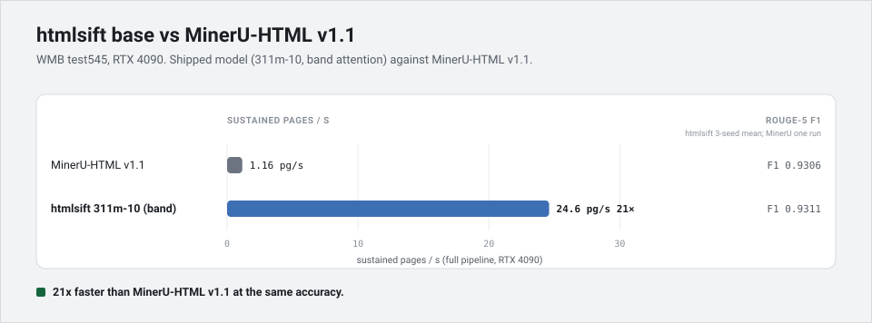
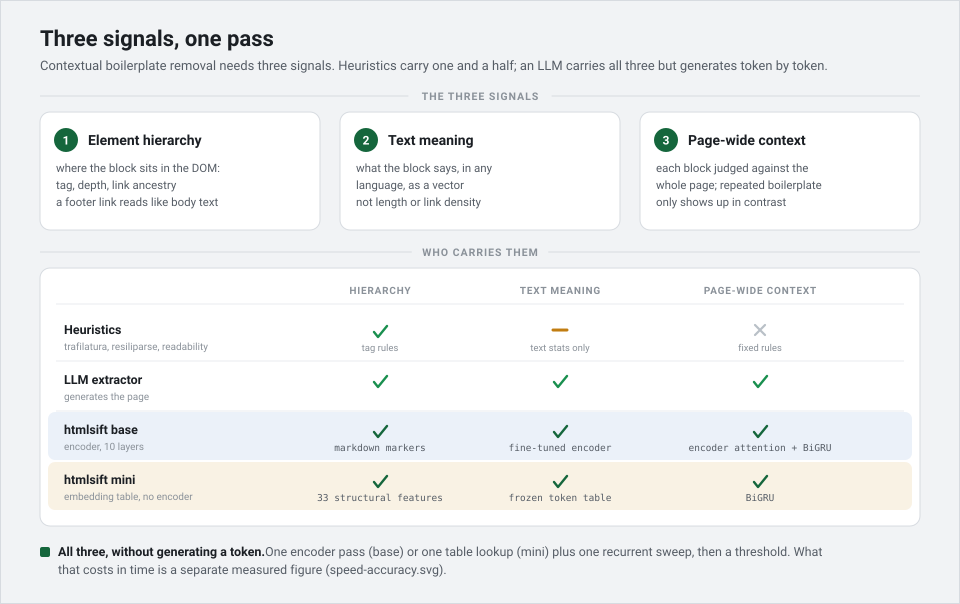
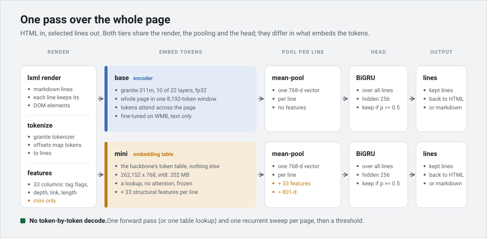
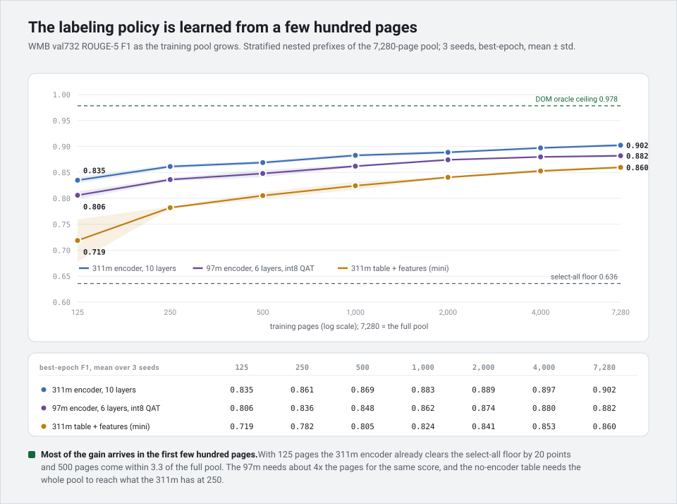

# htmlsift

Main-content extraction for web pages: hand it a raw HTML string and get back the main content
 - nav, ads, cookie banners, and footers stripped
 - outputs raw text, **HTML**, or **markdown**.

Two models shipped, both trained on [WebMainBench][wmb] (WMB) — 7,825 labelled pages, custom split
6,548 train / 732 val / 545 test:

- **`mini`** (default) - a fast int8-ONNX model that runs on CPU. `pip install htmlsift`
- **`base`** - a 311M encoder, most accurate and GPU-capable. `pip install htmlsift[full]`

Each model is fully re-trainable with your own annotated data and the whole research suite is available at [htmlsift-research](https://github.com/koivualeksi/htmlsift-research)

[wmb]: https://github.com/opendatalab/WebMainBench

## Results

| model | desc | WMB test F1 | seeds | CPU (pages/s) | GPU (pages/s) | install |
|---|---|---|---|---|---|---|
| `base` | 311M, 10 layers | **0.9311** | 3 | 0.4 | 24.6 | `htmlsift[full]` |
| unpublished | 97M, 6 layers, int8 QAT | 0.9256 | 3 | 0.9 | 30.2 | — |
| `mini` | int8 embedding table | 0.9010 | 3 | **27.7** | — | `htmlsift` |

* GPU = RTX 4090
* CPU = Ryzen 5 3600 single thread
* WMB test = 544 pages: one of the 545 test pages has no gold reference and is skipped in scoring.

### On CPU


One CPU core, WMB test (544 pages), extraction only. `mini` gets close to trafilatura's
per-page time (36 vs 31 ms median) and scores ~15 F1 points higher. readability and resiliparse are faster but markedly less accurate. 

### On GPU



RTX 4090, WMB test (544 pages). `base` sustains 24.6 pages/s against
MinerU-HTML v1.1's 1.16. A 21x gap at matched accuracy (F1 0.9311 vs 0.9306).

### Cross benchmark accuracy

The shipped models are trained on WMB, so WMB is in-domain. The other two columns are
**zero-shot**, the model never saw WCXB or the multilingual DAnIEL in training. Each column is
scored with that benchmark's own metric. `base` leads every heuristic here; `mini` lands just
behind the best on each board — see **Annotation is a policy** under Concept.

| model | WMB (ROUGE-5) | WCXB (word-F1, zero-shot) | DAnIEL (ROUGE-L, zero-shot) |
|---|---|---|---|
| `base` | 0.9311 | 0.8633 | 0.9175 |
| `mini` | 0.9010 | 0.8474 | 0.8797 |
| trafilatura | 0.7525 | 0.8584 | 0.8265 |
| readability | 0.8016 | 0.7653 | 0.8925 |
| resiliparse | 0.7135 | 0.7909 | 0.7094 |

Model rows are 3-seed test means; heuristics are single deterministic runs.

## Installation

```bash
pip install htmlsift          # default: the mini model (CPU, ONNX)
pip install htmlsift[full]    # adds the base 311M model (torch; GPU-capable)
```

- **`htmlsift`** — the `mini` model only; few dependencies (onnxruntime + tokenizers + lxml +
  numpy + huggingface-hub). First use downloads ~230 MB of model files.
- **`htmlsift[full]`** — adds `torch` + `transformers` to run `base`. First use of `base`
  downloads ~1 GB.

Requires Python 3.10+. Model files download from the Hugging Face Hub on first use and are
cached; prefetch with `htmlsift download mini` (or `base`), or set `HF_HUB_OFFLINE=1` to run
from cache only.

## Usage

```python
from htmlsift import Extractor

ex = Extractor()                     # defaults to "mini"
ex.extract(html)                     # -> str (plain text)
ex.extract(html, output="html")      # keep structure, links, images
ex.extract(html, output="markdown")  # clean markdown: [text](url), 
ex.extract(html, with_blocks=True)   # -> (blocks, probs) for callers who want each line and its prediction individually
```

Module-level convenience (cached singleton):

```python
import htmlsift
htmlsift.extract(html)               # default mini
```

The larger model, from the `[full]` install:

```python
ex = Extractor("base")               # 311M encoder; uses the GPU when one is present,
                                     # else CPU (with a warning)
ex = Extractor("base", device="cuda")  # require the GPU (errors if none is available)
ex = Extractor("base", device="cpu", threads=4)  # force CPU; `threads` sets parallelism
```

`mini` is CPU-only (int8 ONNX); asking it for a GPU raises. Only `base` runs on the GPU.

### Example

Nearly 1 MB of Wikipedia HTML ([Photosynthesis](https://en.wikipedia.org/wiki/Photosynthesis))
in — the boilerplate (nav, sidebar, citations, footer) dropped, the article kept. The verbatim
head of the markdown (`mini` and `base` return the same here):

```python
md = Extractor().extract(html, output="markdown")
```

```markdown
# Photosynthesis

From Wikipedia, the free encyclopedia

For other uses, see [Photosynthesis (disambiguation)](https://en.wikipedia.org/wiki/Photosynthesis_(disambiguation)).

Schematic of photosynthesis in plants. The [carbohydrates](https://en.wikipedia.org/wiki/Carbohydrate) produced are stored in or used by the plant.

Composite image showing the global distribution of photosynthesis, including both oceanic [phytoplankton](https://en.wikipedia.org/wiki/Phytoplankton) and terrestrial [vegetation](https://en.wikipedia.org/wiki/Vegetation). Dark red and blue-green indicate regions of high photosynthetic activity in the ocean and on land, respectively.

**Photosynthesis** is a [system](https://en.wikipedia.org/wiki/Biological_system) of [biological processes](https://en.wikipedia.org/wiki/Biological_process) by which [photopigment](https://en.wikipedia.org/wiki/Photopigment)-bearing [autotrophic](https://en.wikipedia.org/wiki/Autotroph) [organisms](https://en.wikipedia.org/wiki/Organism), such as most [plants](https://en.wikipedia.org/wiki/Plant), [algae](https://en.wikipedia.org/wiki/Algae) and [cyanobacteria](https://en.wikipedia.org/wiki/Cyanobacteria), convert light energy—typically from sunlight—into the chemical energy necessary to fuel their metabolism…
```

### Output modes

| `output` | what you get |
|---|---|
| `text` (default) | selected content as plain text |
| `html` | selected DOM, with structure / links / images kept |
| `markdown` | clean markdown, links and images preserved |


## Concept

<details>
<summary><b>How it works</b></summary>

### Line level labeling


Most extractors decide keep-or-drop on HTML *elements*. htmlsift first renders the page to
markdown *lines*, then decides keep-or-drop on each line. The trade-off is in the figure above, a line-based ceiling sits below the element level gold ceiling but there are far fewer units to classify per page.

### HTML 'signals' utilized

- **Where it sits**: in the DOM - tag, nesting depth, whether it's inside a link.
- **What it says**: a multilingual embedding of the line's tokens.
- **The whole-page context**: repeated boilerplate only stands out in contrast to the rest
  of the page, so every line is judged against all the others by a BiGRU.



Heuristic extractors carry the first one and a half of these; an LLM carries all three but
pays to generate the page token by token. htmlsift carries all three in one pass, and outputs predictions without needing a decoder.



Both tiers share the render, the per-line pooling, and the BiGRU head. They differ only in the text processing section
- mini converts text to tokens and mean-pools them, has no internal attention allowing fast CPU processing
- base uses granite r2 311m embedder using only first 10 layers requiring GPU for efficient usage 


</details>

<details>
<summary><b>Annotation is a policy</b></summary>


htmlsift learns what counts as main content from a benchmark's labels, so it's most accurate on pages that follow that policy. On WebMainBench (the benchmark the shipped models train on) it beats the common heuristic extractors by a wide margin. Zero-shot on benchmarks with different policies, the gap narrows: the 311M `base` still edges every heuristic tested (trafilatura, readability, resiliparse) on both WCXB and DAnIEL, and `mini` lands just behind the strongest heuristic on each board, ahead of the rest.

Train htmlsift on a different policy and it turns around. Fit it to WCXB instead of WMB and it tops WCXB but loses points on other benchmarks. For example when training `base` model on WCXB data, WMB falls to 0.8479, DAnIEL to 0.8826 while WCXB climbs up to 0.9209. Whichever policy you train on, htmlsift leads there and pays for it elsewhere.

For more information, review the [htmlsift-research](https://github.com/koivualeksi/htmlsift-research) readme.

</details>

<details>
<summary><b>Training and retraining</b></summary>

Most of the accuracy arrives in the first few hundred labelled pages — the model learns a
benchmark's labelling policy quickly, so retraining on your own labels is cheap.



These models were trained in the **htmlsift-research** repository. To reproduce the boards or
retrain on your own data, see [htmlsift-research](https://github.com/koivualeksi/htmlsift-research)
and its `docs/REPRODUCE.md`.

</details>

<details>
<summary><b>Known limits</b></summary>

A standalone hero image that is its own block renders to no text line, so it can't be selected
today. Inline images inside a kept block are preserved in `html` and `markdown`.

</details>

## License

Apache-2.0. See [LICENSE](LICENSE).

Model weights are distributed from the Hugging Face Hub, also under Apache-2.0, and are
trained on [WebMainBench](https://github.com/opendatalab/WebMainBench) (Apache-2.0); please
attribute WebMainBench when you use them.

## References

- **WMB — WebMainBench.** The training benchmark; ROUGE-5 main-content metric.
  Liu et al., *Dripper: Token-Efficient Main HTML Extraction with a Lightweight LM*.
  [arXiv:2511.23119](https://arxiv.org/abs/2511.23119) ·
  [repo](https://github.com/opendatalab/WebMainBench)
- **WCXB — Web Content Extraction Benchmark.** Foley, *WCXB: A Multi-Type Web Content Extraction
  Benchmark*. [arXiv:2605.21097](https://arxiv.org/abs/2605.21097) ·
  [repo](https://github.com/Murrough-Foley/web-content-extraction-benchmark)
- **DAnIEL.** Multilingual news corpus (Mutuvi et al.,
  [LREC 2020](https://aclanthology.org/2020.lrec-1.509/)); main-content scoring follows
  *Multilingual Evaluation of Main Content Extractors for Web Pages*, SIGIR 2025
  ([ACM](https://dl.acm.org/doi/10.1145/3726302.3730234)).

